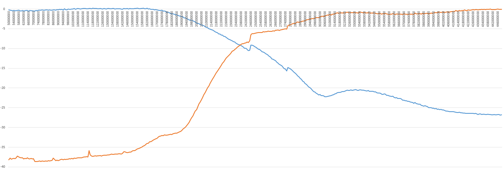

# 2m/70cm Diplexer

[OSHPark Project](https://oshpark.com/shared_projects/0GlwsfHV)

## Characteristics

## BOM

 - 2x [1008 56nH](https://www.tme.eu/en/details/cw1008-56/smd-coils/ferrocore/)
 - 2x [1008 15nH](https://www.tme.eu/en/details/cw1008-15/smd-coils/ferrocore/)
 - 1x [1008 100nH](https://www.tme.eu/en/details/cw1008-100/smd-coils/ferrocore/)
 - 2x [0805 22pf](https://www.tme.eu/en/details/cl21c220jbannnc/0805-mlcc-smd-capacitors/samsung/)
 - 2x [0805 8.2pF](https://www.tme.eu/en/details/cl21c8r2cbannnc/0805-mlcc-smd-capacitors/samsung/)
 - 1x [0805 5.6pF](https://www.tme.eu/en/details/cl21c5r6cbaannc/0805-mlcc-smd-capacitors/samsung/)
 - 3x [SMA](https://www.ebay.com/sch/i.html?_from=R40&_sacat=0&_nkw=sma+female+pcb+edge+mount&rt=nc&LH_BIN=1)
 - 1x [PCB](https://oshpark.com/shared_projects/0GlwsfHV)

## License

[Apache License Version 2.0](./LICENSE)

## Donate

**LTC:** LWt34ZqNgCQPMJJFon7VX8Qbb1ejBHUcnR

**BTC:** 1YMKn8cp98mF7LPa3yndLKE1xQUYUqg8P
